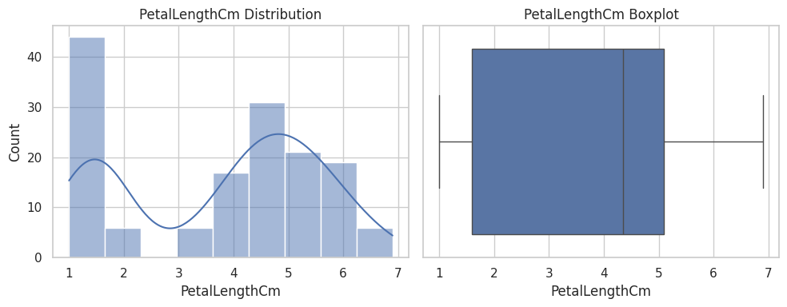
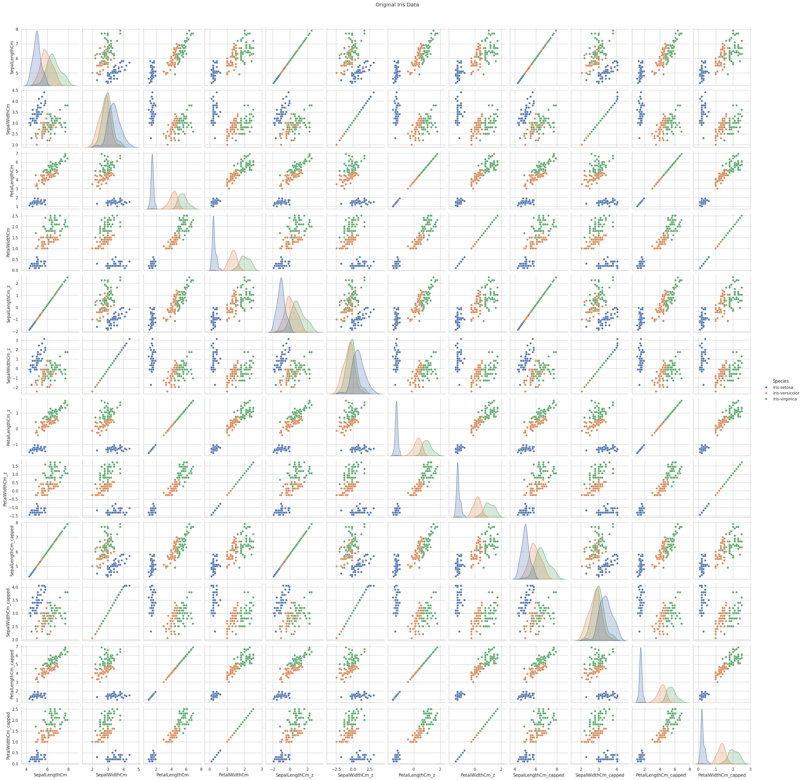

# 🌸 Iris Dataset Preprocessing and Visualization

## Description 💡

In this project, I performed data preprocessing and exploratory data analysis (EDA) on the Iris dataset. The work includes:

- Handling missing values to ensure clean data for analysis.  
- Visualizing the distribution of key features using histograms and boxplots.  
- Creating pairplots to explore relationships and correlations between different features and how they vary across Iris species.  
- Providing insights into the dataset’s structure and underlying patterns through graphical representations.

This analysis lays the foundation for further machine learning or statistical modeling on the Iris dataset.

## 📊 Visualizations

### 📌 Petal Length Distribution & Boxplot

### 📌 Pairplot of Iris Features
This pairplot shows relationships between all features of the Iris dataset along with class separation.

